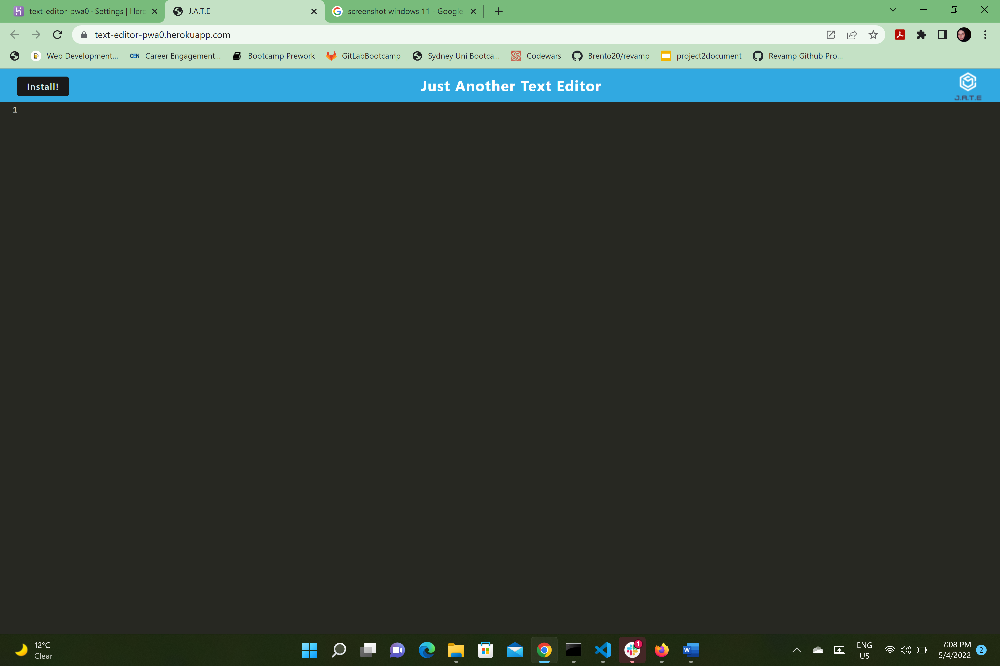
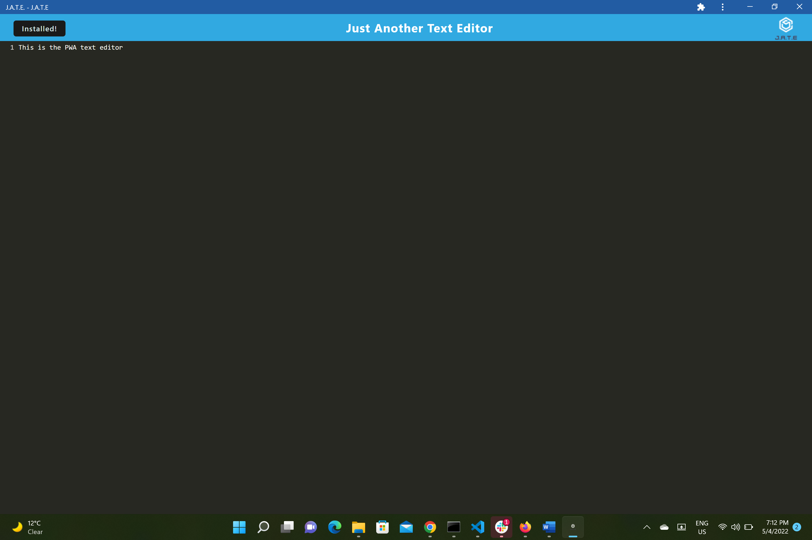

# PWA Text Editor

## Description

The application is a Node.js and express application that allows the user to add and delete notes. Express.js is used for back end, while notes' data is saved and retreived from a JSON file.

## Installation

Please visit the application deployed link here: https://text-editor-pwa0.herokuapp.com/

## Usage

Upon loading the homepage the user will be is able to write in the text area:  

  

There is a button to install the application.   
Upon installing the application then opening the installed version the same text loads as in the browser window:
  

